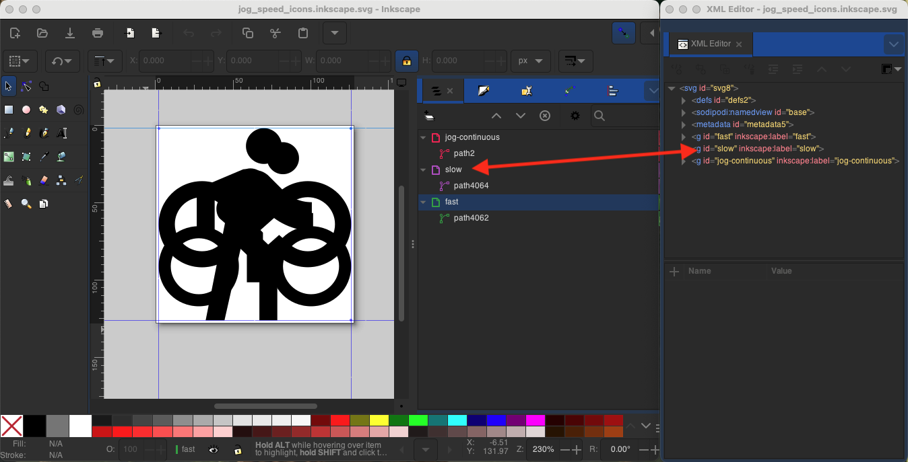

GMOCCAPY Icon Themes
====================

Icon Themes for LinuxCNC's GMOCCAPY Interface

# Icon Theme

Icon themes are used to customize the look and feel of gmoccapy's icons.

Gmoccapy ships with three different icon themes:

* classic: The classic gmoccapy icons
* material: A modern icon theme inspired by Google's Material Icons that automatically adopts its coloring from the selected desktop theme
* material-light: Derived from material but optimized for light desktop themes

The icon theme used in gmoccapy is a regular GTK IconTheme that follows the freedestktop icon theme specification.
Thus every valid GTK IconTheme can be used as gmoccapy icon theme as long as it contains the required icons.

Gmoccapy scans the following directories for IconThemes:

* linuxcnc/share/gmoccapy/icons
* ~/.icons

# Custom Icon Theme

Creating a custom IconTheme is pretty easy. All you need is a text editor and of course the desired icons as pixel or vector graphics.
Details about how exactly an IconTheme is built can be found at
[Freedesktop: Icon Theme Specification](https://specifications.freedesktop.org/icon-theme-spec/icon-theme-spec-latest.html)

Start by creating an empty directory with the name of the icon theme. Place the directory in one of gmoccapy's IconTheme directories.
Then we need a file called index.theme in the root folder of our icon theme which contains the required metadata for the theme.
Thats a simple text file with at least the following sections:

```ini
[Icon Theme]
Name=YOUR_THEME_NAME
Comment=A DESCRIPTION OF YOUR THEME
Inherits=hicolor
Directories=16x16/actions,24x24/actions,32x32/actions,48x48/actions,scalable/actions
```

* Name: The name of your icon theme
* Comment: A description of your icon theme
* Inherits: A icon theme can derive from another icon theme, the default is hicolor
* Directories: A comma separted list of all the directories of your icon theme

Each directory usually contains all the icons of the theme in a specific size, for example 16x16/actions should contain all icons with the category "actions" in the size 16x16 pixels as pixel-graphics (e.g. png files).
A special case is the directory called "scalable/actions", this contains scalable icons not tied to a specific size (e.g. svg files).

By supplying different sized versions of the icons, we can guarantee a nice looking icon if different sizes and we also have the ability to change the icon according to its size, for example a 64x64 px sized icon may contain more details than its 16x16 px version.

Fo each directory we also have to write a section in the index.theme file:

```ini
[16x16/actions]
Size=16
Type=Fixed
Context=Actions
[scalable/actions]
Size=48
Type=Scalable
Context=Actions
```

* Size: Nominal icon size in this direcotry
* Type: Fixed, Threshold or Scalable
* Context: Intended "category" of icons

Basically that's everything needed to create a custom IconTheme.

# Symbolic Icons

Symbolic icons are a special type of icon, usually a monochrome image. The special feature of symbolic icons is that the icons are automatically colored at runtime to match the desktop theme.
That way, icon themes can be created that work well with dark and also light desktop themes (in fact, that's not always the best option, that's why a dedicated "material-light" theme exists).


To make use of the symbolic feature, a icon file has to have the suffix .symbolic.$ext (where $ext is the regular file extension like png) for example "power_on.symbolic.png".

With that name, GTK treats this image as symbolic icon and applies some recoloring when loading the icon.
There are only four colors allowed to use:

| Color | Hex Code  | Description                                                                   |
|-------|-----------|-------------------------------------------------------------------------------|
| black | `#000000` | Primary color, gets changed to match the desktop themes primary color         |
| red   | `#ff0000` | Success: this color indicates "success" (usually somethin green'ish)          |
| green | `#00ff00` | Warning: this color indicates "warning"  (usually somethin yellow/orange'ish) |
| blue  | `#0000ff` | Error: this color indicates "error" (usually somethin red'ish)                |

**TIP** Examples of symbolic icons can be found at linuxcnc/share/gmoccapy/icons/material Theme


# Building

To build the icons in this repository use the `build.sh` script in the root directory.

## Requirements

* python3 >= 3.8
* inkscape

## Prepare python virtual environment

```sh
python3 -m venv env
source env/bin/activate
python3 -m pip install -r requirements.txt
```

For details on using python virtual environment see [Installing packages using pip and virtual environments](https://packaging.python.org/en/latest/guides/installing-using-pip-and-virtual-environments/)


# Development

The structured is as follows:

```
src
├── _build_helper.py                # Helper script for composing the final icon
└── $name                           # Icon theme directory  
    ├── build.py                    # Build script for the icon theme
    ├── index.theme                 # Metadata for the icon theme
    ├── LICENSE                     # License for the icon theme
    ├── NOTICE                      # Notices for the icon theme
    └── svg                         # Directory containing the source SVG files for the icons
        └── $icon.inkscape.svg
```

The `svg` directory contains the source SVG files for the icons. It is recommended to use Inkscape to create and edit the SVG files.
Each icon should be named `$icon.inkscape.svg` where `$icon` is just a descriptive name for the icon or icons in this file.

The `build.py` script is used to build the icon theme from the SVG files. It will generate the required PNG files in the appropriate directories and also create symbolic icons if needed.
The `_build_helper.py` script is a helper script that is used by the `build.py` script to generate the final icons. It contains functions for generating the icons in different sizes and formats.
It utilizes Inkscape to convert the SVG files to PNG files.

The `index.theme` file contains the metadata for the icon theme (see [Freedesktop: Icon Theme Specification](https://specifications.freedesktop.org/icon-theme-spec/icon-theme-spec-latest.html)). It is required for the icon theme to be recognized by gmoccapy.

The `LICENSE` file contains the license for the icon theme. It is recommended to use the same license as the original icons or a compatible license.
The `NOTICE` file contains notices for the icon theme. It is recommended to include any notices or acknowledgements for the original icons or any third-party libraries used in the icon theme.

## Inkscape SVG Files

The SVG files in the `svg` directory should be created using Inkscape. It is recommended to use the following settings when creating the SVG files:

* Canvas size: 128x128 pixels
* Viewbox: 0 0 128 128
* Each icon should be centered in the canvas
* Each icon must be in a unique layer named after the icon (e.g. "slow", "fast")

The layer id can be set via the Inkscape XML Dialog:



(**Note**: It's not sufficient to just name the layer, the layer id must be set to the name of the icon, otherwise the build script will not find the layer and the icon will not be generated correctly.)

## Build Script

Each icon is exported different sizes. Each icon is configured in the `build.py` script as follows:

```python
    jog_speed_svg = svg("jog_speed_icons.inkscape.svg")
    composer.add(f"jog_continuous.symbolic.png",
                src_file=jog_speed_svg,
                context="actions",
                layers=["jog-continuous"]
                )
```

This allows some dynmic configuration of the icons, for example the `layers` parameter allows to specify which layer of the SVG file should be used for the icon:

```python
    jog_speed_svg = svg("jog_speed_icons.inkscape.svg")
    for speed in ["slow", "fast"]:
        composer.add(f"jog_speed_{speed}.symbolic.png",
                     src_file=jog_speed_svg,
                     context="actions",
                     layers=[speed]
                     )
``` 

This will create two icons `jog_speed_slow.symbolic.png` and `jog_speed_fast.symbolic.png` using the layers "slow" and "fast" of the SVG file `jog_speed_icons.inkscape.svg`.


# Contributing

Contributions are welcome! 

If you have any ideas for new icons or improvements to the existing icons, feel free to raise an issue or open a pull request.

